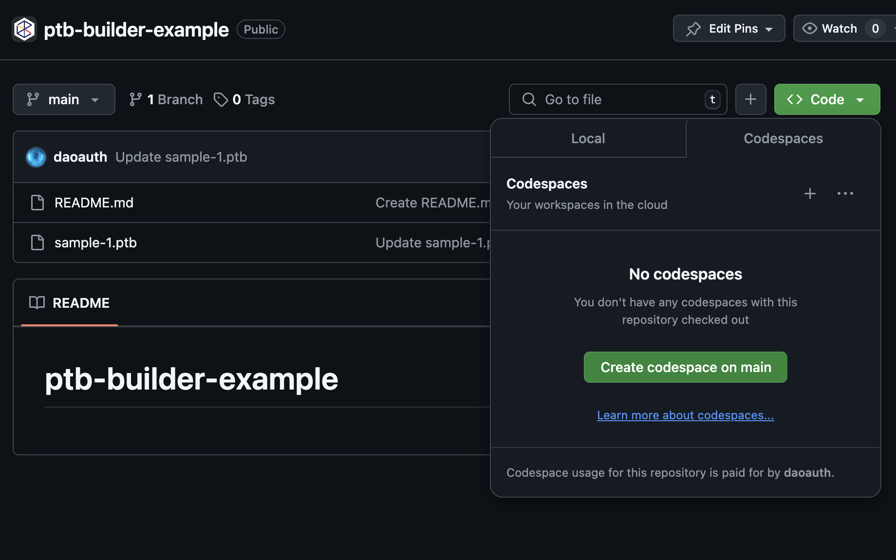
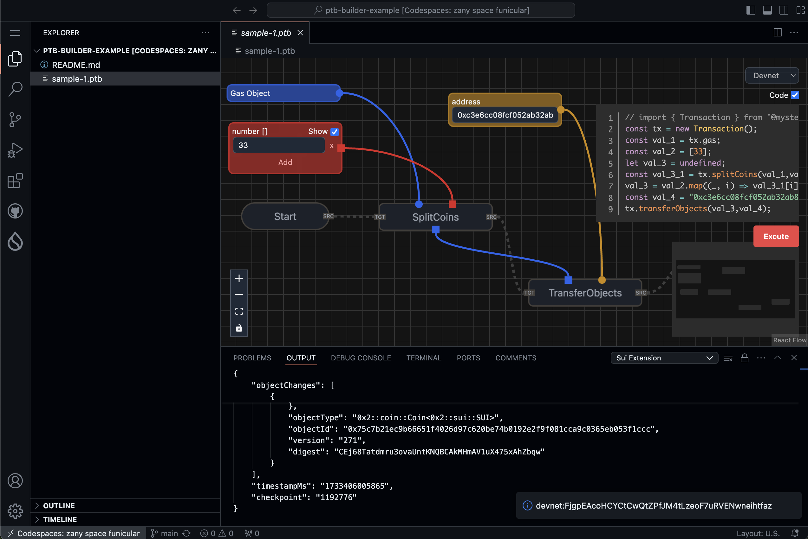
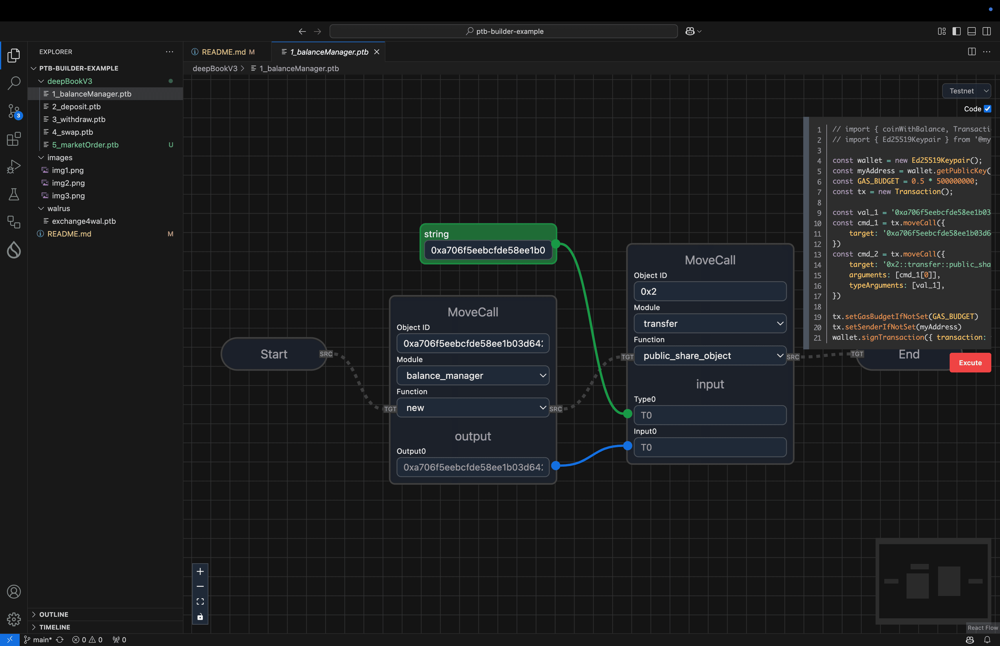
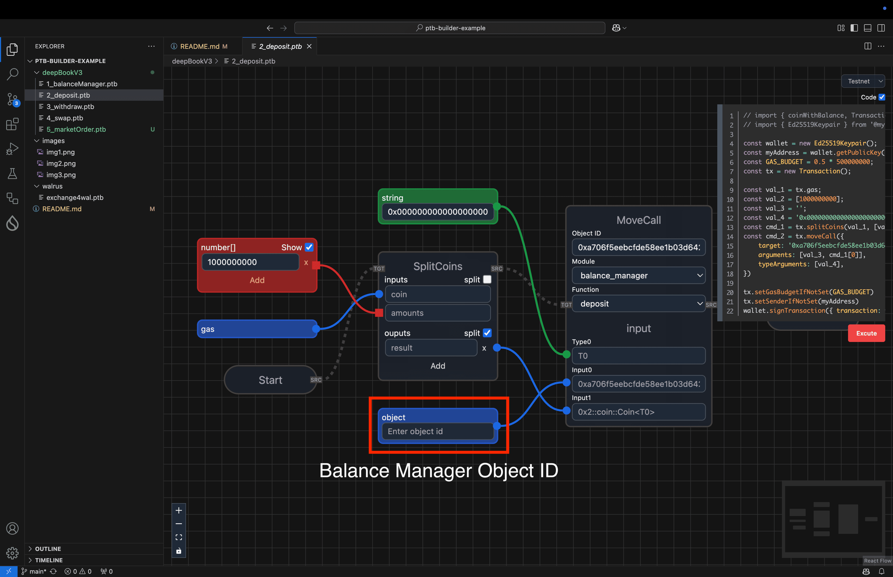
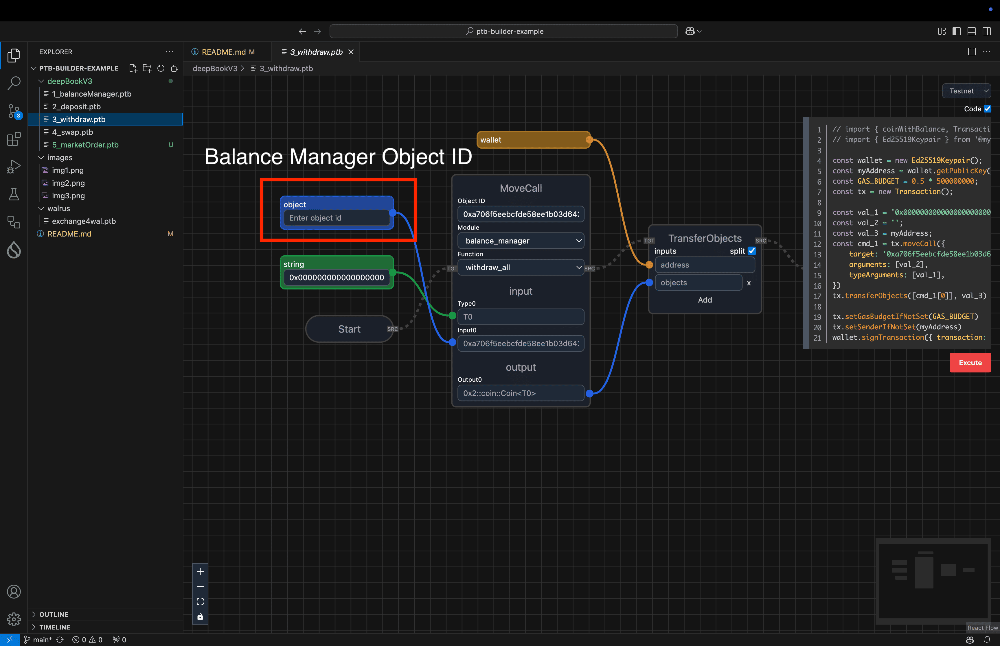
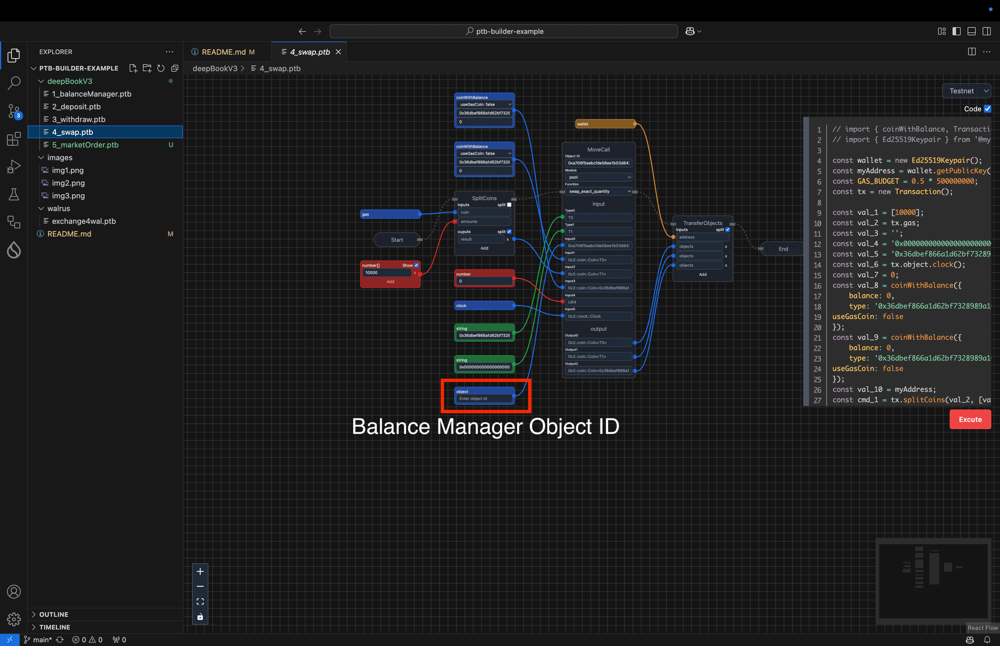
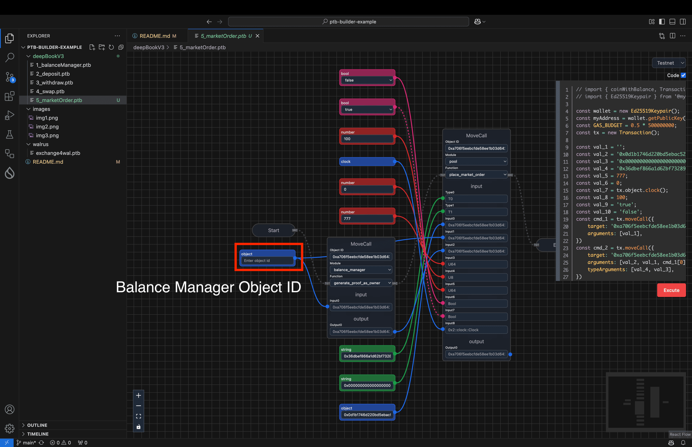

# ptb-builder-example

## Start with codespaces

## Install Sui Extension

## Excute Transaction

## Smaples

### DeepBook: Create Balance Manager

### DeepBook: Deposit

### DeepBook: Withdraw

### DeepBook: Swap

### DeepBook: Market Order

